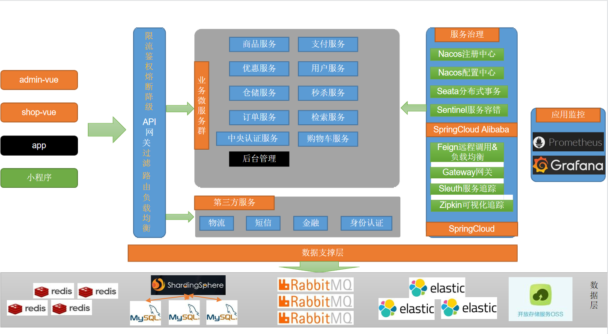

## 项目介绍

 **采优园** 是一个提供售卖生鲜农产品的分布式生鲜电商平台，对农产品进行供应链保鲜销售，系统会收集社区消费者的下单信息，采优园大数据分析系统定时对销售数据和消费者的反馈进行数据分析与反馈，方便农产品供应商可以改进种植方案，形成一个闭环反馈，响应“三农”政策，助力农业经济发展；项目开发组由前端、后端和大数据端三方开发人员组成，项目目前已参加多项比赛：全国大学生电子商务“创新、创意及创业”挑战赛省赛金奖，中国国际“互联网+”大学生创新创业大赛已进入省赛阶段等；项目已经在微信小程序端初步部署。


### 1. 小程序部分图片


### 2. 扫码进入小程序


### 3. 组织结构

``` lua
AgriculturalMall
├── mall-common -- 工具类及通用代码
├── mall-admin -- 后台商城管理系统接口
├── mall-search -- 基于Elasticsearch的商品搜索系统
├── mall-auth-server -- SpringSecurity封装公用模块
├── mall-cart --购物车模块
├── mall-coupon --营销优惠模块
├── mall-getway --网关服务模块
├── mall-member --会员服务模块
├── mall-order --订单服务模块
├── mall-product --商品sku、spu模块
├── mall-seckill --商品秒杀服务模块
├── mall-third-party --阿里云、微信支付模块
├── mall-ware --库存服务模块
├── renren-fast --人人第三方开源框架
├── renren-generator --人人代码自动生成器
```


### 4. 技术选型

| 技术                 | 说明                | 官网                                           |
| -------------------- | ------------------- | ---------------------------------------------- |
| SpringBoot           | Web应用开发框架      | https://spring.io/projects/spring-boot         |
| SpringSecurity       | 认证和授权框架      | https://spring.io/projects/spring-security     |
| MyBatis-Plus         | ORM框架            | https://baomidou.com/                          |               
| Elasticsearch        | 搜索引擎            | https://github.com/elastic/elasticsearch       |
| RabbitMQ             | 消息队列            | https://www.rabbitmq.com/                      |
| Redis                | 内存数据存储         | https://redis.io/                              |
| LogStash             | 日志收集工具        | https://github.com/elastic/logstash            |
| Kibana               | 日志可视化查看工具  | https://github.com/elastic/kibana              |
| Nginx                | 静态资源服务器      | https://www.nginx.com/                         |
| Docker               | 应用容器引擎        | https://www.docker.com                         |
| Jenkins              | 自动化部署工具      | https://github.com/jenkinsci/jenkins           |
| Druid                | 数据库连接池        | https://github.com/alibaba/druid               |
| OSS                  | 对象存储            | https://github.com/aliyun/aliyun-oss-java-sdk  |
| Redission            | 分布式锁支持         | https://github.com/redisson/redisson          |
| JWT                  | JWT登录支持         | https://github.com/jwtk/jjwt                   |
| Lombok               | Java语言增强库      | https://github.com/rzwitserloot/lombok         |
| Hutool               | Java工具类库        | https://github.com/looly/hutool                |
| Swagger-UI           | API文档生成工具      | https://github.com/swagger-api/swagger-ui      |
| SpringCloud          | 微服务管理框架      | https://spring.io/projects/spring-cloud          |


### 5. 系统架构图


### 6. 开发环境

| 工具          | 版本号 | 下载                                                         |
| ------------- | ------ | ------------------------------------------------------------ |
| JDK           | 1.8    | https://www.oracle.com/technetwork/java/javase/downloads/jdk8-downloads-2133151.html |
| Mysql         | 5.7    | https://www.mysql.com/                                       |
| Redis         | 7.0    | https://redis.io/download                                    |
| RabbitMQ      | 3.10.5 | http://www.rabbitmq.com/download.html                        |
| Nginx         | 1.22   | http://nginx.org/en/download.html                            |
| Elasticsearch | 7.17.3 | https://www.elastic.co/downloads/elasticsearch               |
| Logstash      | 7.17.3 | https://www.elastic.co/cn/downloads/logstash                 |
| Kibana        | 7.17.3 | https://www.elastic.co/cn/downloads/kibana                   |
